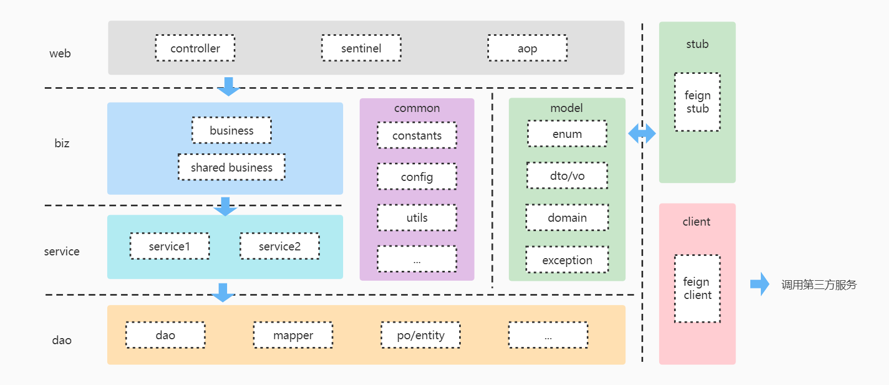

# wf-template 微服务脚手架

wf-template 是一个基于 Spring Cloud 的微服务架构脚手架项目，旨在规范服务分层、快速搭建企业级微服务系统。通过高度解耦的模块设计与丰富的基础能力封装，助力研发团队高效开发、快速落地微服务项目。

---

## ✨ 项目亮点

- 标准化的微服务分层架构，便于团队协作和代码维护
- 集成数据库、缓存、消息队列、注册中心、分布式锁、限流、分布式事务、流程编排等常用能力
- 支持快速生成新业务服务，降低重复劳动
- 内置日志注解、全链路监控、接口文档自动生成（Swagger）
- 代码注释清晰，易于二次开发

---

## 🏗️ 项目结构

```markdown
xxx-client：调用第三方服务统一封装，处理特殊异常或返回码，隔离 service 层的影响。
xxx-common：微服务内部通用特征集合，如业务异常码、常量、异常定义等。
xxx-dao：存储层交互逻辑，如 DB 的增删改查。
xxx-facade：web 实现层，含 biz/service 引用，是业务的逻辑入口。
xxx-facade-stub：微服务能力接口定义，原则上该模块最简依赖 model。
xxx-service：业务逻辑单元封装，具备复用性。
xxx-biz：单元服务聚合层，含复杂业务逻辑，是对 service 的组装。
xxx-model：领域模型定义，可对外开放。
```

> **注意：** facade 为应用核心层，微服务部署时默认只有 xxx-facade-stub 和 xxx-model 会被上传到私服。



---

## 🧩 基础架构模块

```markdown
wf-core-base: 微服务通讯协议体定义，如 result 对象等。
wf-core-boot: springframework 启动组件自定义相关配置，如日志加载。
wf-core-util: 常用工具类、自定义日志注解等。
wf-starter-cache: 统一缓存封装。
wf-starter-database: 数据库组件及配置封装。
wf-starter-feign: 默认集成 feign 客户端，定义熔断等 RPC 策略。
wf-starter-lock: 分布式锁封装。
wf-starter-logger: slf4j 日志实现封装，当前使用 log4j2。
wf-starter-mq: rocketmq 消息队列客户端。
wf-starter-nacos: 默认集成 Nacos 配置中心。
wf-starter-process: 流程编排相关抽象，适用于复杂业务场景。
wf-starter-sentinel: 限流相关组件。
wf-starter-sequence: 分布式自增 ID 生成。
wf-starter-timer: 分布式延迟队列实现。
wf-starter-transaction: 基于本地事务表的分布式事务解决方案。
```

---

## 🧩 wf-template 与 wf-starter 组件协同使用说明

本项目（`wf-template`）为业务微服务项目的脚手架模板，需搭配 [`wf-starter`](https://github.com/zwm1005/wf-starter) 基础组件库联合使用。  
**`wf-template` 主要负责微服务的分层结构和开发规范，而实际的通用能力（如数据库、缓存、注册中心、消息队列、分布式锁、限流、日志等），均由 `wf-starter` 提供并托管为一系列 Spring Boot Starter 组件。**

### 依赖关系说明

- `wf-template` 仅包含项目结构和规范，不直接包含具体的基础能力实现。
- 你应在基于 `wf-template` 生成的新微服务项目的 `pom.xml` 中**按需引入 `wf-starter` 的各类 Starter 组件**，以获得所需的数据库、缓存、分布式锁等功能复用。
- 例如：
  ```xml
  <dependency>
      <groupId>fun.werfamily.starter</groupId>
      <artifactId>wf-starter-database</artifactId>
      <version>最新版本号</version>
  </dependency>
  <dependency>
      <groupId>fun.werfamily.starter</groupId>
      <artifactId>wf-starter-cache</artifactId>
      <version>最新版本号</version>
  </dependency>
  <!-- 更多 wf-starter 能力可按需引入 -->
  ```

### 推荐使用流程

1. **使用 `wf-template` 或 `gen_microservice.py` 快速生成新微服务项目骨架**
2. **在新项目的 `pom.xml` 中引入所需的 `wf-starter` 组件（如数据库、缓存、MQ 等），实现统一能力复用**
3. **二者需保持版本兼容，建议同步升级，避免依赖冲突**

> **注意：** 若 `wf-starter` 组件未引入，相关能力不可用，启动时可能出现类缺失等问题。

---

## 🚀 快速开始

### 1. 利用脚手架 Python 脚本快速生成新微服务项目

本项目配套提供了 `gen_microservice.py` 脚本，支持在 `/wf-template` 目录下直接运行，自动生成一个与 `wf-template` 同级的新微服务项目。

#### 脚本位置

- 脚本文件：`wf-template/gen_microservice.py`
- 建议将脚本保留在 `wf-template` 目录下

#### 用法

在 `/wf-template` 目录下执行如下命令：

```bash
python gen_microservice.py --project 新项目名 --package 新包名 --group 新groupId --artifact 新artifactId
```

**参数说明：**

- `--project`   新项目目录名（如 `wf-order`）
- `--package`   新包名（如 `fun.werfamily.order`）
- `--group`     新 groupId（如 `fun.werfamily.trade`）
- `--artifact`  新 artifactId（如 `wf-order`）

**示例：**

```bash
cd wf-template
python gen_microservice.py --project wf-order --package fun.werfamily.order --group fun.werfamily.trade --artifact wf-order
```

**运行效果：**

- 在 `wf-template` 的上一级目录生成 `wf-order`（与 `wf-template` 同级）。
- 自动完成包名、groupId、artifactId、模块名等全局替换，并清理 `.git` 目录等冗余内容。

> 如遇目标目录已存在，会提示并中止操作，防止误覆盖。

---

### 2. 启动服务

以 facade 为例，直接运行启动类：

```java
@SpringBootApplication(scanBasePackages = {"fun.werfamily.template.*"})
public class Application {
    public static void main(String[] args) {
        SpringApplication.run(Application.class, args);
    }
}
```

---

### 3. 接口文档

已集成 Swagger3，仅需访问 `/swagger-ui/` 即可查看 API 文档，自动聚合所有标注 `@ApiOperation` 的接口。

---

## 🛠️ 常用开发约定

- `client` 层仅用于对接第三方服务，避免污染业务逻辑。
- 业务开发主要聚合于 `service`、`biz`、`facade` 层，遵循单一职责、接口隔离原则。
- 通用能力（如日志、缓存、分布式锁）通过 starter 模块引入，无需重复造轮子。
- 接口出入参 model 独立，便于服务间解耦和版本升级。

---

## 🌐 技术栈

- Spring Boot / Spring Cloud
- MyBatis / MySQL / Redis / RocketMQ
- Nacos / Feign / Sentinel / Log4j2
- Swagger3 / Lombok

---

## 📝 示例代码

### 接口定义（Stub）

```java
@FeignClient(name = "wf-template", fallback = DemoFacadeFallBack.class)
public interface DemoFacade {
    @ApiOperation("Demo接口")
    @PostMapping(path = "/api/demo/add")
    Result<DemoDTO> add(@RequestBody DemoReq demoReq);
}
```

### 控制器（Facade）

```java
@RestController
@RequestMapping("/api/demo")
@Api(tags = "DEMO")
public class DemoController {
    @Autowired
    private DemoBiz demoBiz;

    @ApiOperation("demo接口")
    @PostMapping("/add")
    @WfLog
    public Result<DemoDTO> add(@Validated @RequestBody DemoReq demoReq) {
        return Result.success(demoBiz.add(demoReq));
    }
}
```

---

## 🙏 贡献指南

1. Fork 本仓库，创建 feature 分支编写代码
2. 提交 PR 并补充必要的注释、文档说明
3. 保持模块分层与规范化，优先复用公共基础能力

---

## 📞 联系作者

如有问题或建议，欢迎通过以下方式联系作者或提交 Issue：

- 💬 QQ交流群：`1051233835`
- 📧 邮箱：`chx5508@dingtalk.com`  

---

> 💡 本项目持续迭代中，欢迎 **Star** 和 **PR**！
